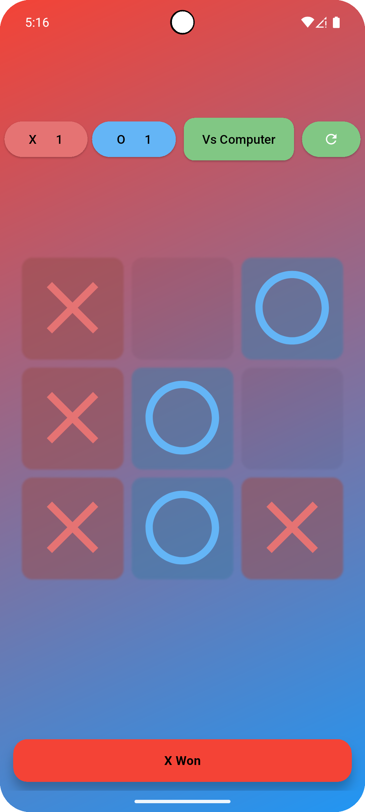
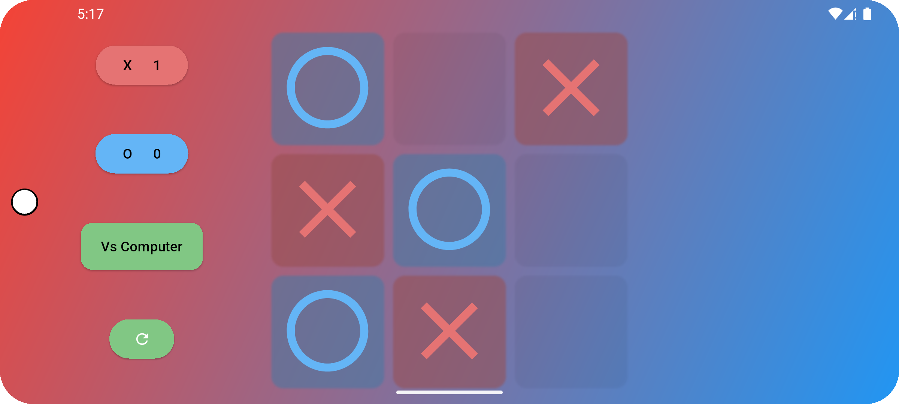

<h1>✨ Tic Tac Toe Game (Flutter)</h1>

  This is a colorful, feature-rich <strong>Tic Tac Toe</strong> game built with Flutter. 
  It lets you play against another player or challenge a simple yet smart AI.  
  The game also keeps track of scores, handles win detection, and has a clean, responsive UI.

<h2>🚀 Features</h2>
<ul>
  <li>Play <strong>Vs Player</strong> mode or <strong>Vs Computer</strong> mode.</li>
  <li>Automatic win detection with highlight & score update.</li>
  <li>Smart AI that tries to win, blocks you, or takes the center/corner.</li>
  <li>Beautiful gradient background and intuitive design.</li>
  <li>Responsive layout: works in portrait & landscape modes.</li>
  <li>Snackbar messages to notify about wins, invalid moves, or switching modes.</li>
</ul>

<h2>🧠 How the AI Works</h2>

  The AI checks for possible winning spots first, blocks your possible winning moves, 
  then picks the center, a corner, or finally any available side.

<h2>🛠 How to Run</h2>
<ol>
  <li>Make sure you have <a href="https://flutter.dev/docs/get-started/install">Flutter</a> installed.</li>
  <li>Clone this repository:</li>
  <pre><code>git clone https://github.com/your-username/your-repo-name.git</code></pre>
  <li>Navigate to the project folder:</li>
  <pre><code>cd your-repo-name</code></pre>
  <li>Run the app:</li>
  <pre><code>flutter run</code></pre>
</ol>

<h2>📱 Screenshots</h2>

    
    

<h2>💡 How to Play</h2>
<ol>
  <li>Choose your symbol (X or O) by tapping the button on top/side.</li>
  <li>Choose "Vs Player" or "Vs Computer" to switch opponent mode.</li>
  <li>Tap on empty cells to make your move. The AI plays automatically when it’s its turn.</li>
  <li>See the score update when someone wins.</li>
  <li>Press the refresh button to restart the game anytime.</li>
</ol>

<h2>🤝 Contributing</h2>
<ul>
  <li>Fork this repository.</li>
  <li>Create a new branch (<code>git checkout -b feature-branch</code>).</li>
  <li>Commit your changes (<code>git commit -m "Add new feature"</code>).</li>
  <li>Push to the branch (<code>git push origin feature-branch</code>).</li>
  <li>Create a Pull Request explaining your changes.</li>
</ul>

<h2>⭐ Credits</h2>

Built with ❤️ using <a href="https://flutter.dev/">Flutter</a>.
